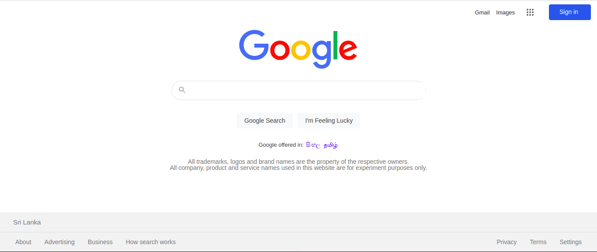
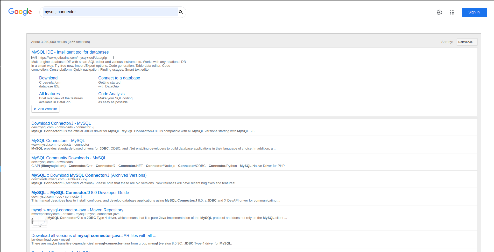

# google_search_clone
Experiment Project that works like Google Search 

## The Repository
This repository is where I have developed a google clone as an individual project during my training duration at IJSE Institue. The main purpose of this project is to develop and learn mainly html5, css3. And further more I use this project to develop my ability to work with the google customer search engine. I have published my full source code in this repository. This source code is available to everyone under the standard [MIT licence](./LICENSE.txt).

### The basic customized view of the UI

### The basic customized view of the UI

## LICENSE
Copyright © 2022 Dhanushka Madhushan. All Rights Reserved.  
This project is licensed under [MIT](LICENSE.txt) License.